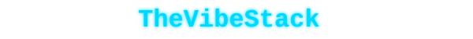

<div align="center">



[](https://git.io/typing-svg)

</div>

### 👋 Hey, soy **TheVibeStack** 🇲🇽

Soy de México. Me apasiona la tecnología y actualmente ando construyendo cosas con IA.

**Co-fundador de [trazolab.com](https://trazolab.com)**

[](https://x.com/TheVibeStack)

---

### 🧬 Mi Evolución

```
ChatGPT    →    Cursor    →    Antigravity    →    Claude    →    Hermes + Kimi    →    OpenCode + Z.ai
  🔥            ⚡              🚀                🤖               🧠                    🎯
```

<div align="center">

[](https://git.io/typing-svg)

</div>

---

### 🛠️ Mi Stack Actual

#### 🔥 Uso Diario


#### ⚡ Orquestación


#### 🎨 IDE + Chat + Design


#### 🧪 Experimentando


---

### 🐍 Contribuciones

<div align="center">


</div>
